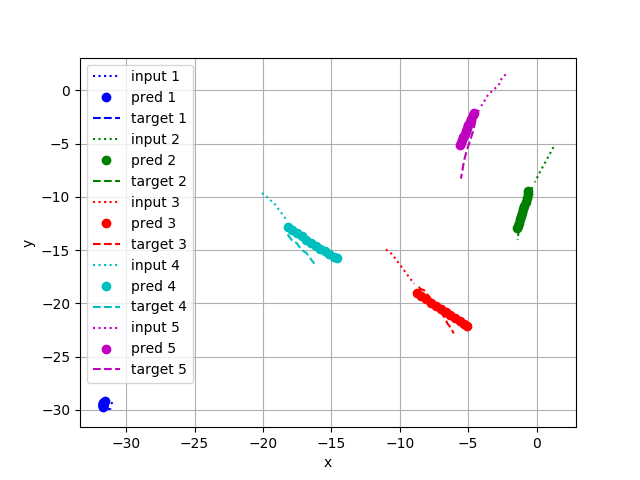

# social-cnn-pytorch

This repository was built for the Stanford CS230 course project "Human Trajectory Prediction in Socially Interacting Crowds". The "main_scripts" directory contains all the major functionalities, such as training, testing, and plotting. The "rerun_scripts" directory contains scripts for re-running the pre-trained models and logging the training and validiation losses. The "test_for_trajnet" directory contains scripts to create predictions for test sets provided by Stanford Trajectory Forecasting Benchmark[1]. An abstract from the project report is as follows: 

This project aims to predict human trajectories in dense crowds for robotic motion planning applications. Inspired by prior work [2] and a recent success in Convolutional Neural Networks (CNN) for sequence-to-sequence tasks, we propose a data-driven approach that employs CNN for trajectory prediction of multiple pedestrians at once. The performance evaluation on a publicly available dataset [1] suggests that our approach successfully predicts reasonable trajectories for multiple pedestrians in different scenes. The extensive error analysis and the trajectory analysis also reveal the cases where our model has difficulty in capturing unusual pedestrian behavior or social interactions.

[1] A. Sadeghian, V. Kosaraju, A. Gupta, S. Savarese, and A. Alahi, “Trajnet: Towards a benchmark for human trajectory prediction,” arXiv preprint, 2018.

[2] N. Nikhil and B. T. Morris, “Convolutional neural networkfor trajectory prediction,” arXiv preprint arXiv:1809.00696, 2018.
